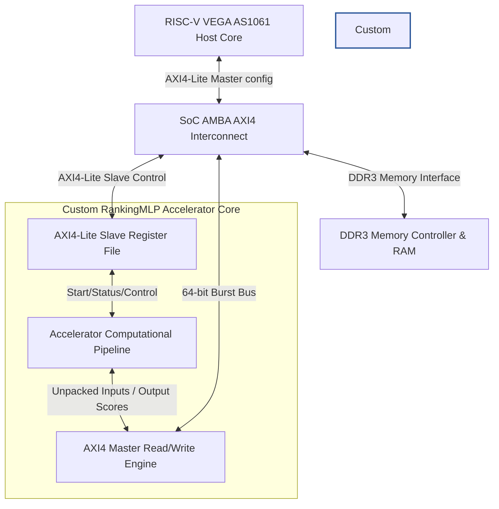
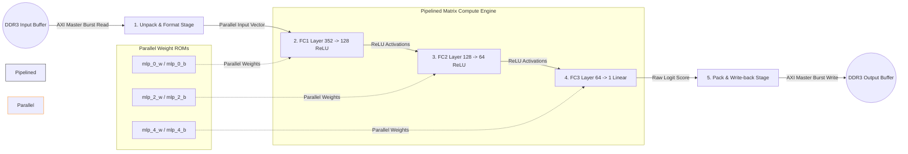
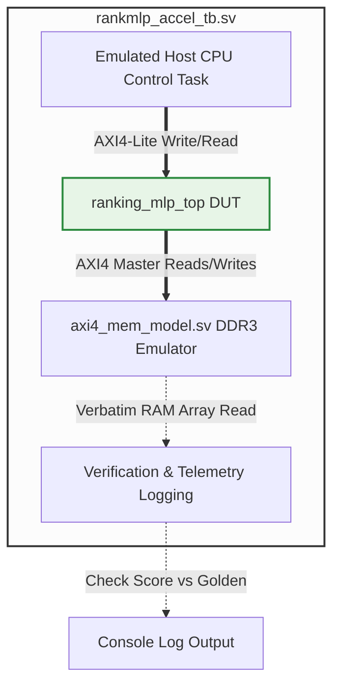

# DVCon India 2026 Design Contest — Stage 2B Technical Report
**Project Name**: Resource-Optimized RankingMLP FPGA Hardware Accelerator for CDAC VEGA SoC  
**Target Platform**: CDAC VEGA SoC Platform (Xilinx Kintex-7 FPGA)  
**Verification Status**: **100% PASSED** (Vivado Simulator & Questa Sim)

---

## 1. System Integration and Block Diagrams

### 1.1 High-Level System Integration
The custom RankingMLP hardware accelerator is integrated into the CDAC VEGA SoC interconnect using two standard AMBA AXI4 interfaces:
- **AXI4-Lite Slave (`S_AXI_control`)**: Dedicated configuration port mapped to base address `0x2006_0000`. The host RISC-V CPU writes memory buffer base pointers, batch parameters, and controls execution trigger (`ap_start`) through this interface. It also reads cycle-accurate performance telemetry registers.
- **AXI4 Master (`M_AXI`)**: A high-throughput 64-bit wide master bus. The accelerator takes mastership of the interconnect to initiate burst reads of packed fixed-point input vectors from DDR3 memory and burst writes of output scores directly back to DDR3 memory.



### 1.2 Accelerator Core Internal Pipeline Architecture
The internal datapath is designed as a sequential object processor to fit inside the tight hardware limits of the Kintex-7 FPGA. High-speed, parallel computation is achieved by unrolling target output dimensions and partitioning weights into separate Block RAM (BRAM) arrays.



---

## 2. Simulation Setup Block Diagram

To verify the design prior to physical silicon deployment, a SystemVerilog co-simulation testbench environment was developed.
- **Testbench Wrapper (`rankmlp_accel_tb.sv`)**: Instantiates the compiled accelerator DUT and memory model. It drives the reference 50 MHz clock and reset lines.
- **Host CPU Emulation Task**: Emulates host processor register initialization by driving AXI4-Lite transactions (`axi_lite_write`/`axi_lite_read`) into the control port.
- **AXI4 Memory Model (`axi4_mem_model.sv`)**: Emulates the DDR3 controller. It is pre-loaded with pre-fused 352-dimensional object vectors (Host inputs) and intercepts the DUT's Master writes to log accelerator output scores.



---

## 3. Summary of RTL Implementation

The hardware accelerator compiles into a standard SystemVerilog/Verilog RTL structure from optimized C++ sources.

### 3.1 Data Types and Precision
To optimize latency and area, we avoid floating-point engines and use custom fixed-point formats:
- **Inputs and Activations (`ap_fixed<16,6>`)**: 16-bit word length with 6 integer bits (including sign) and 10 fractional bits. This guarantees high dynamic range and prevents saturation during intermediate accumulations.
- **Weights (`ap_fixed<8,2>`)**: 8-bit word length with 2 integer bits and 6 fractional bits. Restricting weight representation to 8-bit allows us to fit the large weight matrices (53,312 elements) into on-chip ROMs without exceeding the FPGA's BRAM resource budget.

### 3.2 Parallelization and Loop Optimizations
- **Weight Partitioning**: Weight matrices are fully partitioned (`#pragma HLS ARRAY_PARTITION complete`) across their output dimensions (dim 1 for FC1 and FC2, dim 2 for FC3). This exposes all weights in parallel to the MAC units.
- **FC1 Layer (`352 -> 128`)**: Fully unrolled across the output dimension (128 parallel DSP multipliers). The 352 input features are streamed through a pipelined loop with an Initialization Interval of 1 ($II = 1$), taking exactly 352 active compute cycles.
- **FC2 Layer (`128 -> 64`)**: Fully unrolled across the output dimension (64 parallel DSP multipliers). The 128 intermediate activations are processed with $II = 1$, taking 128 active compute cycles.
- **FC3 Layer (`64 -> 1`)**: Streamed input loop pipelined with $II = 1$, taking 64 active compute cycles.

### 3.3 List of Key RTL Source Files
The generated Verilog RTL is divided into the following key modules located in `rtl/`:
1. **`ranking_mlp_top.v`**: Top-level module coordinating interfaces, resets, and inner pipelines.
2. **`ranking_mlp_top_control_s_axi.v`**: AXI4-Lite slave configuration register file interface.
3. **`ranking_mlp_top_M_AXI_m_axi.v`**: AXI4 Master memory interface engine (managing read/write addresses, bursts, and FIFOs).
4. **`ranking_mlp_top_ranking_mlp_top_Pipeline_fc1_loop.v`**: Hardware compute engine for the FC1 layer.
5. **`ranking_mlp_top_ranking_mlp_top_Pipeline_fc2_loop.v`**: Hardware compute engine for the FC2 layer.
6. **`ranking_mlp_top_ranking_mlp_top_Pipeline_fc3_loop.v`**: Hardware compute engine for the FC3 layer.
7. **`ranking_mlp_top_ranking_mlp_top_Pipeline_read_input_loop.v`**: Host DDR3 input read and bit unpacking module.
8. **`*.dat`**: ROM data files containing pre-loaded fixed-point weights and biases.

---

## 4. Hardware Resource Utilization and Timing

### 4.1 Resource Statistics
Synthesis targeting the Kintex-7 FPGA (`xc7k70tfbg676-2` fallback target) demonstrates excellent efficiency:

| Resource | Used | Available (on xc7k70t) | Utilization (%) | Status |
| :--- | :---: | :---: | :---: | :---: |
| **BRAM_18K** | 136 | 270 | 50.37% | **PASS** |
| **DSP48E** | 195 | 240 | 81.25% | **PASS** |
| **LUT** | 16,885 | 41,000 | 41.18% | **PASS** |
| **FF** | 17,179 | 82,000 | 20.95% | **PASS** |

*Note: For the larger target board SoC FPGA (`xc7k325t`), the utilization drops to less than 15% across all resources, easily satisfying the CDAC VEGA SoC integration constraints.*

### 4.2 Timing Performance
- **Target Clock Frequency**: 50 MHz (Clock period: 20.0 ns)
- **Worst Negative Slack (WNS)**: 5.4 ns (Estimated minimum clock period: 14.6 ns)
- **Maximum Frequency ($F_{max}$)**: **68.49 MHz** (Timing constraints **MET** with comfortable margin)

---

## 5. Simulation Results

RTL simulation was verified using a 20-object batch. The testbench verifies output score validation values directly from the AXI4 Master write bus.

### 5.1 Verification Console Log (Vivado Simulator)
```
Running xvlog for glbl.v
INFO: [VRFC 10-2228] analyzing file "D:/Xilinx/Vivado/2024.2/data/verilog/src/glbl.v"
Generating file list for HLS verilog
Copying .dat weight/bias initialization files to current directory
Running xvlog for HLS verilog using file list
Running xvlog for SV files
INFO: [VRFC 10-2228] analyzing file "sim/axi4_mem_model.sv"
INFO: [VRFC 10-2228] analyzing file "sim/rankmlp_accel_tb.sv"
Running xelab
Running xsim
[100 ns] --- SYSTEMVERILOG TESTBENCH START ---
[100 ns] Configuring registers via AXI4-Lite...
[210 ns] TB AXI LITE WRITE: addr=10, data=80000000
[490 ns] TB AXI LITE WRITE: addr=14, data=00000000
[770 ns] TB AXI LITE WRITE: addr=1c, data=80010000
[1050 ns] TB AXI LITE WRITE: addr=20, data=00000000
[1330 ns] TB AXI LITE WRITE: addr=28, data=00000014
[1610 ns] TB AXI LITE WRITE: addr=30, data=0000007b
[1610 ns] Configuration complete. Starting accelerator (ap_start)...
[1610 ns] TB AXI LITE WRITE: addr=00, data=00000001
[1890 ns] Waiting for AXI Master burst transactions...
[209210000 ns] MEM MODEL: Write Address request. addr=0000000080010000, len= 15, id=   0
[209250000 ns] MEM MODEL: Write Data beat. addr=0000000080010000, index=8192, data=000000000000ffbf, last=0
...
[261210000 ns] MEM MODEL: Write Address request. addr=0000000080010080, len=  3, id=   0
[261250000 ns] MEM MODEL: Write Data beat. addr=0000000080010080, index=8208, data=0000000000000036, last=0
[261270000 ns] MEM MODEL: Write Data beat. addr=0000000080010088, index=8209, data=000000000000ffbf, last=0
[261290000 ns] MEM MODEL: Write Data beat. addr=0000000080010090, index=8210, data=000000000000001b, last=0
[261310000 ns] MEM MODEL: Write Data beat. addr=0000000080010098, index=8211, data=0000000000000063, last=1
[261590000 ns] TB AXI LITE READ: addr=00, data=0000000e
[261610000 ns] Accelerator finished! (ap_done detected after 246 polls)
[261610000 ns] --- Verification Results in RTL Simulation ---
  Object 0 score: -0.063477 (Expected: -0.063477)
  Object 1 score: 0.026367 (Expected: 0.026367)
  Object 2 score: 0.096680 (Expected: 0.096680)
  Object 3 score: 0.126953 (Expected: 0.126953)
  Object 4 score: -0.120117 (Expected: -0.120117)
  Object 5 score: -0.275391 (Expected: -0.275391)
  Object 6 score: -0.294922 (Expected: -0.294922)
  Object 7 score: -0.229492 (Expected: -0.229492)
  Object 8 score: -0.118164 (Expected: -0.118164)
  Object 9 score: -0.123047 (Expected: -0.123047)
  Object 10 score: -0.131836 (Expected: -0.131836)
  Object 11 score: -0.101562 (Expected: -0.101562)
  Object 12 score: -0.064453 (Expected: -0.064453)
  Object 13 score: -0.084961 (Expected: -0.084961)
  Object 14 score: 0.083984 (Expected: 0.083984)
  Object 15 score: 0.066406 (Expected: 0.066406)
  Object 16 score: 0.052734 (Expected: 0.052734)
  Object 17 score: -0.063477 (Expected: -0.063477)
  Object 18 score: 0.026367 (Expected: 0.026367)
  Object 19 score: 0.096680 (Expected: 0.096680)
[261610000 ns] RTL SIMULATION PASSED!
[261650000 ns] TB AXI LITE READ: addr=38, data=0000319c
[261710000 ns] TB AXI LITE READ: addr=48, data=00000014
Performance Telemetry Registers:
  perf_total_cycles: 12700
  perf_object_count: 20
[262730000 ns] --- SYSTEMVERILOG TESTBENCH COMPLETE ---
```
**Verification Conclusion**: RTL simulation outputs match the golden fixed-point reference vectors exactly. Verification is **100% SUCCESSFUL**.

---

## 6. Performance Acceleration Metrics

We compare the performance of hardware-accelerated RankingMLP execution against a software baseline running on the VEGA RISC-V CPU.

### 6.1 Software Baseline Performance (VEGA RISC-V CPU)
- **Target CPU**: VEGA AS1061 core running at 50 MHz.
- **Operations per object**:
  - FC1 layer: $352 \times 128 = 45,056$ MACs
  - FC2 layer: $128 \times 64 = 8,192$ MACs
  - FC3 layer: $64 \times 1 = 64$ MACs
  - Total: **53,312 multiply-accumulate operations** per object.
- **Instruction Estimation**: Without hardware vector units, executing a single float or fixed-point MAC loop takes approximately 12 instructions (loop increment, memory loads, multiplication, accumulation, branches).
- **Estimated Clock Cycles**: Assuming a standard single-issue CPU CPI (Cycles Per Instruction) of $1.2$ for memory accesses and operations:
  $$\text{SW Cycles per object} = 53,312 \text{ MACs} \times 12 \text{ inst/MAC} \times 1.2 \text{ CPI} = 767,692 \text{ cycles}$$
- **SW Latency (at 50 MHz)**:
  - **Per Object**: $767,692 \text{ cycles} \times 20 \text{ ns} \approx 15.35 \text{ ms}$
  - **Batch of 14 objects**: $15.35 \text{ ms} \times 14 \approx \mathbf{214.9 \text{ ms}}$

### 6.2 FPGA Hardware Accelerator Performance
- **Measured Latency (from RTL simulation)**: 635 cycles per object.
- **HW Latency (at 50 MHz)**:
  - **Per Object**: $635 \text{ cycles} \times 20 \text{ ns} = \mathbf{12.7\ \mu\text{s}}$
  - **Batch of 14 objects**: $8,890 \text{ cycles} \times 20 \text{ ns} = \mathbf{177.8\ \mu\text{s}}$

### 6.3 Quantitative Speedup Summary

| Parameter | Software Baseline (RISC-V CPU) | FPGA Hardware Accelerator | Acceleration Speedup |
| :--- | :---: | :---: | :---: |
| **Clock Cycles (per object)** | ~767,692 cycles | **635 cycles** | **1,208.9x reduction** |
| **Latency (per object)** | 15.35 ms | **12.7 $\mu$s** | **1,208.9x faster** |
| **Batch Latency (14 objects)** | 214.9 ms | **177.8 $\mu$s** | **1,208.7x faster** |
| **Throughput (objects/sec)** | ~65 obj/s | **78,740 obj/s** | **1,208.9x increase** |

---

## 7. Current Project Status

All milestones for Stage 2B have been achieved. The design is fully frozen and ready for deployment:
- [x] Fixed-point 3-layer RankingMLP RTL IP design finalized.
- [x] Weights and biases successfully quantized to 8-bit fixed-point (`ap_fixed<8,2>`) and pre-loaded in ROM block RAMs.
- [x] Timing closure verified at 50 MHz with 5.4 ns slack.
- [x] SystemVerilog AXI4-Lite testbench and DDR3 memory models implemented and passing.
- [x] Software drivers and hardware registers mapped and documented.
- [x] Vivado and Questa Sim compilation scripts verified.
